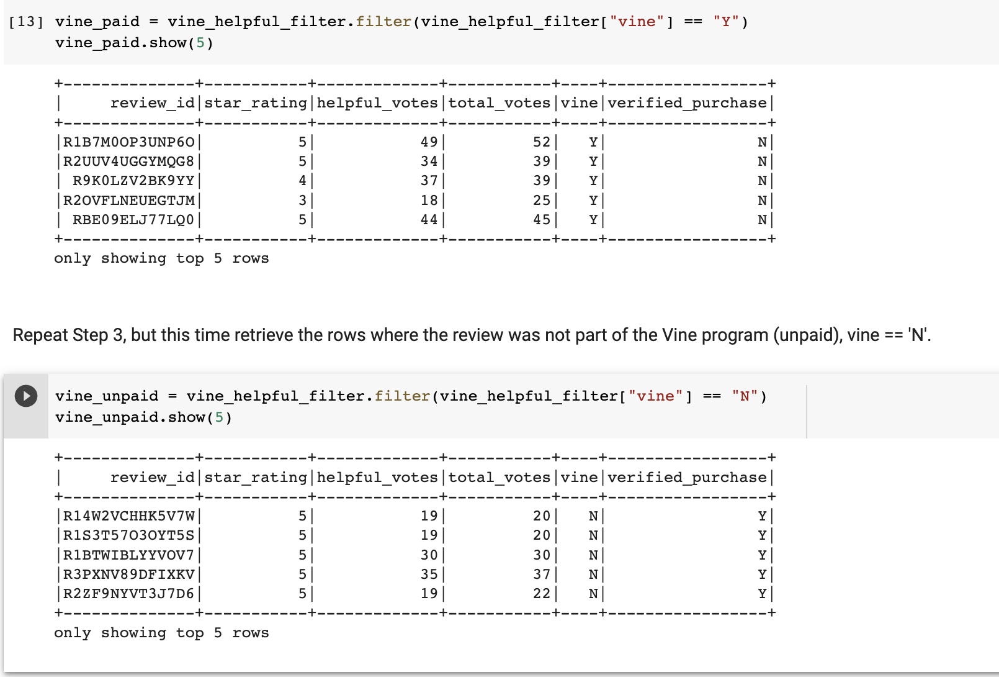
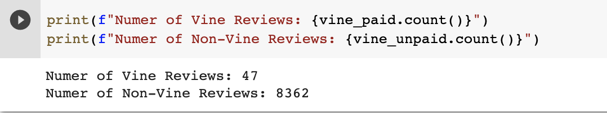
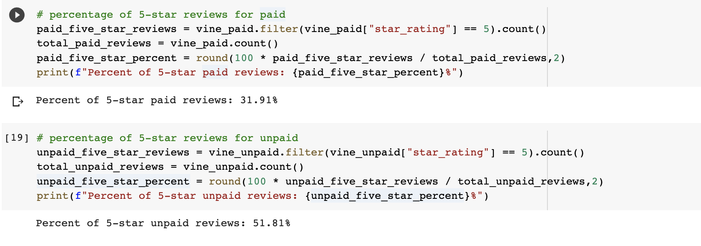

# Amazon_Vine_Analysis
## Overview
In this challenge, we were tasked with analyzing Amazon reviews written by members of the paid Amazon Vine Program. This proogram allows manufacturers and publushers to receve pain reviews for their products. 

We used PySpark to load and clean an Amazon Review dataset and then connected to AWD RDS and ultimately loaded the data into pgAdmin for further analysis. We also used Pyspark to analtze whether or not there was a favorable bias within the paid reviewers.

(please note: deliverable 1 on for this project was done with the Gift Card dataset but there weren't any paid reviews and so the Watch dataset was used for deliverable 2.)

## Results
- How many Vine reviews and non-Vine reviews were there?
    To answer this question we followed a few steps:
    1.  We split the initial watch dataframe into 2 dataframes by the "vine" column which indicated Y (participating in program) or N (not participating in program)
     
    2. We counted the number of rows in each dataframe
     

    **There are a total of 47 vine reviewers and 8,362 non-vine reviewers.**

- How many Vine reviews were 5 stars? How many non-Vine reviews were 5 stars?
    To find the number of 5 star reviews for each category, the following lines of code were run: 
    1. paid_five_star_reviews = vine_paid.filter(vine_paid["star_rating"] == 5).count() 
    2. unpaid_five_star_reviews = vine_unpaid.filter(vine_unpaid["star_rating"] == 5).count() 

     

    **There are a total of 15 5-star vine reviewers and 4,332 5-star non-vine reviewers.**

- What percentage of Vine reviews were 5 stars? What percentage of non-Vine reviews were 5 stars?
    To find the percentage of 5 star reviews for each category, the following steps were taken: 
    1. Find the total number of paid and unpaid 5 star reviews by filtering the star rating column. 
    2. Find the total number of paid and unpaid reviews 

     

    **For Vine reviewers, 31.91% of the reviews were 5-star and for non-Vine reviewers, 51.81% of the reviews were 5-star.**

## Summary
In your summary, state if there is any positivity bias for reviews in the Vine program. Use the results of your analysis to support your statement. Then, provide one additional analysis that you could do with the dataset to support your statement.