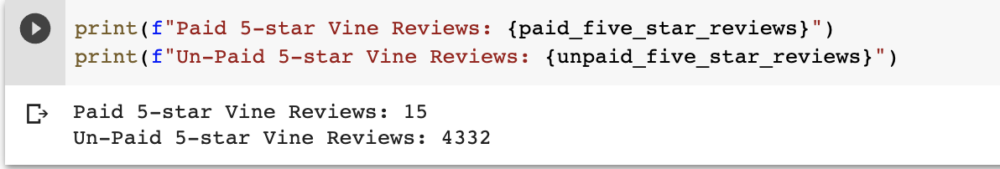

# Amazon_Vine_Analysis
## Overview
In this challenge, we were tasked with analyzing Amazon reviews written by members of the paid Amazon Vine Program. This proogram allows manufacturers and publushers to receve pain reviews for their products. 

We used PySpark to load and clean an Amazon Review dataset and then connected to AWD RDS and ultimately loaded the data into pgAdmin for further analysis. We also used Pyspark to analtze whether or not there was a favorable bias within the paid reviewers.

(please note: deliverable 1 on for this project was done with the Gift Card dataset but there weren't any paid reviews and so the Watch dataset was used for deliverable 2.)

## Results
- ***How many Vine reviews and non-Vine reviews were there?***
    
    To answer this question we followed a few steps:
    1.  We split the initial watch dataframe into 2 dataframes by the "vine" column which indicated Y (participating in program) or N (not participating in program)
     
    2. We counted the number of rows in each dataframe
     

    **There are a total of 47 vine reviewers and 8,362 non-vine reviewers.**

- ***How many Vine reviews were 5 stars? How many non-Vine reviews were 5 stars?***
    
    To find the number of 5 star reviews for each category, the following lines of code were run: 
    1. paid_five_star_reviews = vine_paid.filter(vine_paid["star_rating"] == 5).count() 
    2. unpaid_five_star_reviews = vine_unpaid.filter(vine_unpaid["star_rating"] == 5).count() 

     

    **There are a total of 15 5-star vine reviewers and 4,332 5-star non-vine reviewers.**

- ***What percentage of Vine reviews were 5 stars? What percentage of non-Vine reviews were 5 stars?***
    
    To find the percentage of 5 star reviews for each category, the following steps were taken: 
    1. Find the total number of paid and unpaid 5 star reviews by filtering the star rating column. 
    2. Find the total number of paid and unpaid reviews 

     

    **For Vine reviewers, 31.91% of the reviews were 5-star and for non-Vine reviewers, 51.81% of the reviews were 5-star.**

## Summary

From the results above, there does not seem to be a positivity bias among vine users. The percent of 5-star reviews from the vine users is much lower than that of the non-vine users. That being said, it is also important to note the difference in sample size between the populations. We re comparing 47 vine reviews with 8,362 non-vine reviewers and so it is hard to know what percent of the reviews would be 5-stars if the vine and non-vine populations were equal.

One way to look more generally at the positive reviews would be to group 4 and 5 star reviews together becasue both of those could be considered "good" reviews. This way, we can see if vine reviewers tend to give 4-star reviews but a similar proportion of overall "good" reviews.